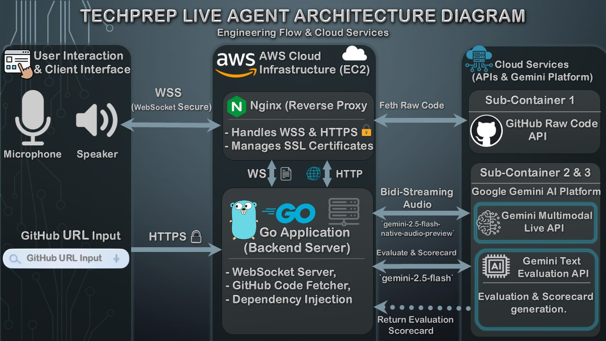

# 🤖 TechPrep Live Agent

**Your 24/7 AI Senior Tech Lead & Career Coach for ANY Tech Stack.**

TechPrep Live Agent is a real-time, voice-first AI companion built with Go and the Gemini Multimodal Live API. It conducts dynamic technical interviews, performs live code reviews via direct GitHub integration, provides a secure code-execution sandbox, and generates automated architectural scorecards. It is designed to help developers practice under pressure and prepare for specific job roles without the hassle of screen-sharing latency.

## 🔥 Killer Features
* **🏢 Custom Job Mock Interviews (Targeted JD):** Paste a specific Job Description (JD), and the AI will act as the Hiring Manager—screening your experience, asking tailored questions, and gracefully concluding the call if your profile doesn't match.
* **🎭 Multi-Persona AI Interviewers:** Choose your challenge! Practice with a friendly *Senior Tech Lead*, a *Strict Technical Interviewer*, a meticulous *Code Reviewer*, or a *Frontend Lead*. 
* **⚡ Ultra-Low Latency Voice:** Bidirectional audio streaming using WebSockets and the highly stable `models/gemini-2.0-flash-exp` via Gemini Live API.
* **🛡️ Secure Live Code Sandbox:** Execute your Go code live during the interview! The Go backend creates a secure, timeout-restricted ephemeral environment to run the code natively, and feeds the *actual* terminal output back to the AI. This eliminates AI hallucinations with 100% accuracy.
* **🐙 Smart GitHub Context Injection (V2):** * **Single File:** Paste a raw file URL for deep line-by-line review.
  * **Full Repository:** Paste a full repo URL, and the backend automatically fetches the `README.md` to discuss overall System Design and Architecture.
* **📊 Interview History & Scorecards:** Generates an automated scorecard highlighting bugs and architectural advice using the Gemini 2.5 Flash Text API. Scorecards are saved locally with an elegant Accordion UI to track your progress over time.
* **🎨 Immersive UI/UX:** Zoom-like dark theme, real-time audio waveform visualizer, AI Avatar nodding animations, and full microphone/AI audio controls (Mute/Pause).
* **🏗️ Production-Ready & CI/CD:** Built with Clean Architecture in Go, fully containerized with **Docker & Nginx**, and backed by **GitHub Actions** for automated Unit Testing and continuous integration.

---

## 🏗️ Architecture
* **Backend:** Go (Golang), Gorilla WebSockets.
* **Frontend:** Vanilla JavaScript, Web Audio API, HTML5, CSS3.
* **Infrastructure:** Docker, Docker Compose, Nginx, AWS EC2, GitHub Actions (CI/CD).
* **AI Models:** Google Gemini Multimodal Live API (Audio) & Gemini 2.5 Flash API (Text).



*(Note: The diagram above illustrates the core routing architecture. The final deployed version has been upgraded to utilize `models/gemini-2.0-flash-exp` for enhanced stability, and includes an internal execution Sandbox connected to the Go Application for secure, real-time code execution).*

---

## 🚀 Quick Start (Recommended: Using Docker)

The easiest way for judges and developers to run this project is using Docker. It spins up both the Go backend and the Nginx reverse proxy automatically.

### Prerequisites
* [Docker](https://docs.docker.com/get-docker/) & [Docker Compose](https://docs.docker.com/compose/install/) installed on your machine.
* A Google Gemini API Key.

### Steps to Run
1. **Clone the repository:**
   ```bash
   git clone https://github.com/Yasser-Badr/techprep-live-agent.git
   cd techprep-live-agent

 2. Set up Environment Variables:
   Create a .env file in the root directory and add your Gemini API Key:
   GEMINI_API_KEY=your_actual_api_key_here

 3. Build and Run with Docker Compose:
   docker-compose up -d --build

 4. Access the Application:
   Open your browser and navigate to: http://localhost
   (Note: Browsers require HTTPS or localhost to allow microphone access. Running on localhost works perfectly for testing).
 5. Stop the Application:
   docker-compose down

## 🎮 How to Use (Demo Flow)
 1. Choose Your Setup: Select a predefined Persona (e.g., Senior Tech Lead) OR choose "Custom Job" and paste a real Job Description.
 2. Start Call: Click Start Call and grant microphone permissions.
 3. Discuss & Review: Talk about your tech stack. Paste a GitHub file or full Repo URL and click Fetch GitHub.
 4. Run Code Live: If you share Go code, click Run Code to execute it in the secure sandbox. The AI will audibly discuss the real terminal output with you!
 5. Control the Flow: Use the Pause Mic or Mute AI buttons if you need a break.
 6. Get Evaluated: Click End Call to receive your detailed architectural Scorecard.
 7. Track Progress: Click the 📜 History button to review your past interview scorecards.

## 🔮 What's Next (Future Roadmap)
While the current MVP is highly stable and feature-rich, we have designed the architecture to accommodate the following future enhancements:
 * ⚡ WebRTC Audio Pipeline: Transitioning from WebSockets to a true WebRTC hybrid approach (using pion/webrtc) to bypass WebSocket header overhead and achieve extreme ultra-low latency for audio packets.
 * 🌍 Polyglot Execution Sandbox: Currently, the secure sandbox natively supports Golang execution. The roadmap includes expanding this to support Python, JavaScript/Node.js, Java, and C++ dynamically using dedicated microVMs.
 * 🌳 Deep AST Repository Analysis: Upgrading the GitHub V2 fetcher to build an Abstract Syntax Tree (AST) of entire repositories for deep, cross-file architectural reviews.

## 🤝 Contributing
Contributions are welcome! Please fork the repository and submit a pull request for any enhancements. Ensure that your PR passes the automated GitHub Actions tests.

## 📝 License
This project is licensed under the MIT License.

*Built with ❤️ for the Gemini API Developer Hackathon.*
