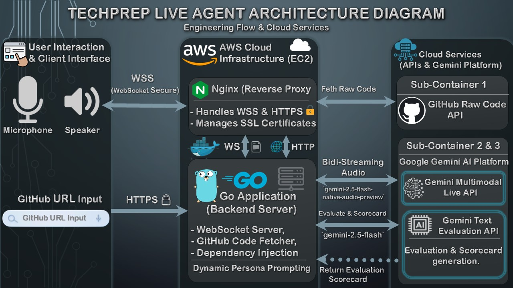

عاش جداً يا هندسة! إضافتك لصورة الـ Architecture (![TechPr
# 🤖 TechPrep Live Agent

**Your 24/7 AI Senior Tech Lead for ANY Tech Stack.**

TechPrep Live Agent is a real-time, voice-first AI companion built with Go and the Gemini Multimodal Live API. It conducts dynamic technical interviews, performs live code reviews via direct GitHub integration, and generates automated architectural scorecards—all designed to help developers practice under pressure without the hassle of screen-sharing latency.

## 🔥 Killer Features
* **🎭 Multi-Persona AI Interviewers:** Choose your challenge! Practice with a friendly *Senior Tech Lead*, a *Strict Technical Interviewer*, a meticulous *Code Reviewer*, or a *Frontend Lead*. The AI adapts its tone and questions dynamically.
* **⚡ Ultra-Low Latency Voice:** Bidirectional audio streaming using WebSockets and the highly stable `models/gemini-2.0-flash-exp` via Gemini Live API.
* **🐙 Smart GitHub Context Injection (V2):** * **Single File:** Paste a raw file URL for deep line-by-line review.
  * **Full Repository:** Paste a full repo URL, and the Go backend automatically fetches the `README.md` and repository structure to discuss overall System Design and Architecture.
* **📊 Interview History & Scorecards:** Generates an automated scorecard highlighting bugs and architectural advice using the Gemini 2.5 Flash Text API. Scorecards are saved locally (via `localStorage`) with an elegant Accordion UI to track your progress over time.
* **🎨 Immersive UI/UX:** Zoom-like dark theme, real-time audio waveform visualizer, AI Avatar nodding animations, and full microphone/AI audio controls (Mute/Pause).
* **🏗️ Production-Ready & CI/CD:** Built with Clean Architecture in Go, fully containerized with **Docker & Nginx**, and backed by **GitHub Actions** for automated Unit Testing and continuous integration.

---

## 🏗️ Architecture
* **Backend:** Go (Golang), Gorilla WebSockets.
* **Frontend:** Vanilla JavaScript, Web Audio API, HTML5, CSS3.
* **Infrastructure:** Docker, Docker Compose, Nginx, AWS EC2, GitHub Actions (CI/CD).
* **AI Models:** Google Gemini Multimodal Live API (Audio) & Gemini 2.5 Flash API (Text).



---

## 🚀 Quick Start (Recommended: Using Docker)

The easiest way for judges and developers to run this project is using Docker. It spins up both the Go backend and the Nginx reverse proxy automatically.

### Prerequisites
* [Docker](https://docs.docker.com/get-docker/) & [Docker Compose](https://docs.docker.com/compose/install/) installed on your machine.
* A Google Gemini API Key.

### Steps to Run
1. **Clone the repository:**
   ```bash
   git clone [https://github.com/Yasser-Badr/techprep-live-agent.git](https://github.com/Yasser-Badr/techprep-live-agent.git)
   cd techprep-live-agent

 2. Set up Environment Variables:
   Create a .env file in the root directory and add your Gemini API Key:
   GEMINI_API_KEY=your_actual_api_key_here

 3. Build and Run with Docker Compose:
   docker-compose up -d --build

 4. Access the Application:
   Open your browser and navigate to: http://localhost
   (Note: Browsers require HTTPS or localhost to allow microphone access. Running on localhost works perfectly for testing).
 5. Stop the Application:
   docker-compose down

## 🛠️ Manual Setup (Without Docker)
If you prefer to run the Go application directly on your machine:
 * Ensure you have Go 1.22+ installed.
 * Clone the repository and navigate into it.
 * Export your API key:
   export GEMINI_API_KEY="your_actual_api_key_here"

 * Download dependencies and run:
   go mod tidy
go run main.go

 * The server will start at http://localhost:8080.
## 🎮 How to Use (Demo Flow)
 * Select Persona: Choose your preferred AI interviewer from the dropdown.
 * Start Call: Click Start Call and grant microphone permissions. The AI will introduce itself naturally.
 * Discuss & Review: Talk about your tech stack. Paste a GitHub file or full Repo URL and click Fetch GitHub. The AI will read the context instantly and discuss it with you.
 * Control the Flow: Use the Pause Mic or Mute AI buttons if you need a break.
 * Get Evaluated: Click End Call to receive your detailed architectural Scorecard.
 * Track Progress: Click the 📜 History button to review your past interview scorecards.
## 🔮 What's Next (Future Roadmap)
While the current WebSocket implementation provides ultra-low latency, we are actively researching the following enhancements:
 * WebRTC Audio Pipeline (V3 PoC): Transitioning to a true WebRTC hybrid approach (using pion/webrtc) to bypass WebSocket header overhead and further reduce packet latency.
 * Deep AST Repository Analysis: Upgrading the GitHub fetcher to build an Abstract Syntax Tree (AST) of the entire repository for system-wide, cross-file architectural reviews.
 ## Contributing
Contributions are welcome! Please fork the repository and submit a pull request for any enhancements. Ensure that your PR passes the automated GitHub Actions tests.

## 📝 License
This project is licensed under the MIT License.
Built with ❤️ for the Gemini API Developer Hackathon.
